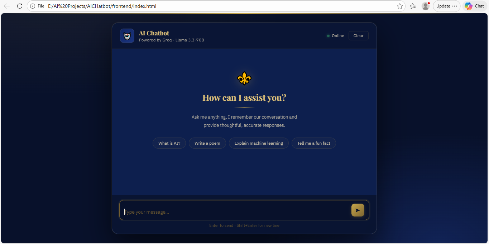
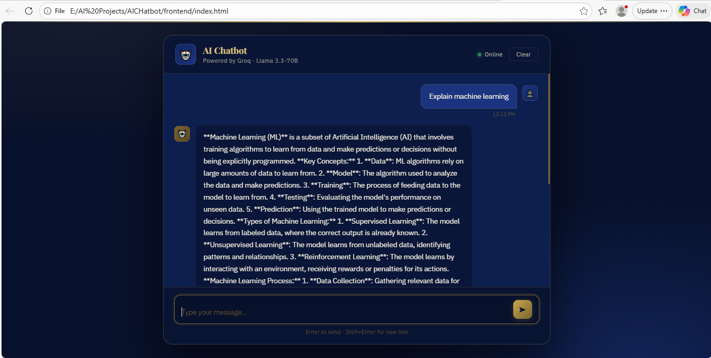
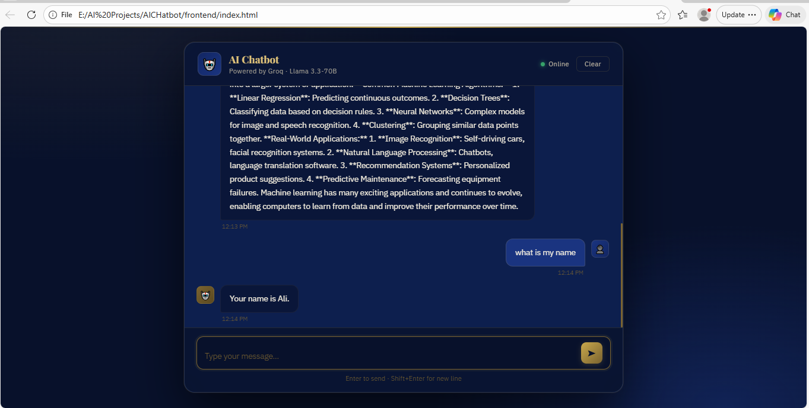

# AI Chatbot

A conversational chatbot built with FastAPI and Groq LLM with persistent conversation memory.



## Features

- Natural conversation powered by Llama 3.3-70B
- Conversation memory across multiple turns
- Fast response time via Groq API
- Clean responsive chat interface
- REST API backend with FastAPI

## Tech Stack

| Layer     | Technology                           |
|-----------|--------------------------------------|
| Frontend  | HTML, CSS, JavaScript                |
| Backend   | FastAPI, Python                      |
| LLM       | Groq API, Llama 3.3-70B              |
| Memory    | LangChain InMemoryChatMessageHistory |

## Project Structure
```
ai-chatbot/
├── main.py          
├── index.html       
├── requirements.txt 
├── welcome.png      
├── chat.png         
└── memory.png       
```

## Getting Started

### 1. Clone the repository
```bash
git clone https://github.com/ghulam06mustafa/ai-chatbot.git
cd ai-chatbot
```

### 2. Install dependencies
```bash
pip install -r requirements.txt
```

### 3. Set up environment variables
Create a `.env` file in the root folder:
```
GROQ_API_KEY=your_groq_api_key_here
```
Get your free API key from [console.groq.com](https://console.groq.com)

### 4. Run the backend
```bash
uvicorn main:app --reload
```

### 5. Open the frontend
Open `index.html` in your browser

## Screenshots






## API Endpoints

| Method | Endpoint | Description         |
|--------|----------|---------------------|
| GET    | /        | Health check        |
| POST   | /chat    | Send message to LLM |

## Author

Ghulam Mustafa  
LinkedIn: https://www.linkedin.com/in/ghulam-mustafa-90133067/  
GitHub: https://github.com/ghulam06mustafa
